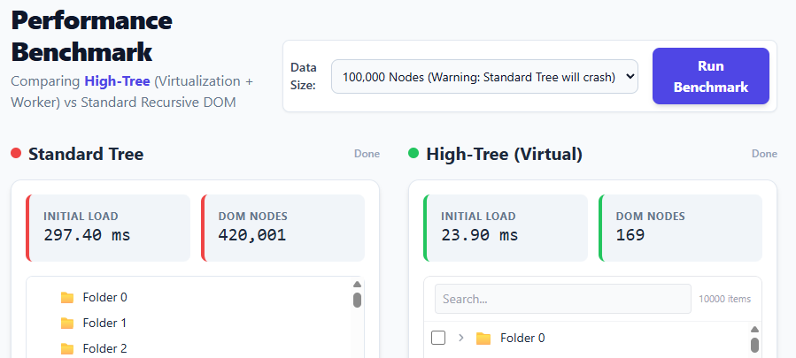

# 🌳 High-Tree

A professional, high-performance virtual tree component for modern web applications. Zero dependencies, lightweight, and extensible.
최신 웹 애플리케이션을 위한 전문가급 고성능 가상 트리 컴포넌트입니다. 의존성 없는 가벼운 라이브러리이며 확장이 용이합니다.

[](https://www.npmjs.com/package/high-tree)
[](https://opensource.org/licenses/MIT)

---

## 💡 Purpose & Intent / 개발 의도

**High-Tree** was born out of a simple necessity: standard HTML tree components break down when dealing with massive datasets. Whether it's a file system with millions of files or a complex organizational chart, traditional DOM-based trees suffer from memory bloat and UI freezes. High-Tree solves this by combining **DOM virtualization** with **Web Worker-based computation**, ensuring your application stays buttery smooth regardless of data size. Our goal is to provide a "professional-grade" tree component that is lightweight, dependency-free, and handles 100k+ nodes without breaking a sweat.

**High-Tree**는 대용량 데이터를 처리할 때 기존 HTML 트리 컴포넌트가 겪는 성능 한계를 극복하기 위해 만들어졌습니다. 수백만 개의 파일 시스템이나 복잡한 조직도처럼 데이터가 방대해질수록 기존 DOM 방식은 메모리 점유율이 치솟고 화면이 멈추는 현상이 발생합니다. High-Tree는 **DOM 가상화**와 **웹 워커(Web Worker)** 기반 연산을 결합하여, 데이터의 양에 관계없이 항상 부드러운 사용자 경험을 제공하는 것을 목표로 합니다. 별도의 라이브러리 의존성 없이 가벼우면서도, 10만 개 이상의 노드도 가뿐히 처리할 수 있는 "전문가급" 트리 컴포넌트를 지향합니다.

---

## 🚀 Performance Benchmark / 성능 벤치마크

We compared High-Tree with a standard recursive DOM tree using **100,000 nodes**.
**100,000개의 노드**를 대상으로 일반적인 재귀적 DOM 트리와 High-Tree를 비교했습니다.



| Metric / 지표                  | Standard Tree (Recursive DOM)   | High-Tree (Virtualization)       | Difference / 차이  |
| :----------------------------- | :------------------------------ | :------------------------------- | :----------------- |
| **Initial Load / 초기 로딩**   | ~297.40 ms                      | **~23.90 ms**                    | **12.4x Faster**   |
| **DOM Nodes / 생성된 노드 수** | 420,001                         | **169**                          | **2,485x Lighter** |
| **Responsiveness / 응답성**    | Significant lag / Screen freeze | **Silky Smooth / 매우 부드러움** | -                  |

---

## ✨ Features / 주요 기능

- 🚀 **Virtual Scrolling / 가상 스크롤링** - Efficiently handles 100,000+ nodes. / 10만 개 이상의 노드도 효율적으로 처리합니다.
- ⚡ **Web Worker Support / 웹 워커 지원** - Background processing for heavy operations. / 무거운 연산을 백그라운드에서 처리하여 UI 멈춤을 방지합니다.
- 🔍 **Persistent Editing / 지속적인 편집** - Robust double-click editing with Save/Cancel. / 저장/취소 기능이 포함된 강력한 더블 클릭 편집 모드를 지원합니다.
- ⚡ **Lazy Loading / 지연 로딩** - On-demand node loading for massive datasets. / 대용량 데이터를 위한 온디맨드 노드 로딩을 지원합니다.
- 🏗️ **Tree CRUD / 트리 관리** - Simple APIs for node addition, deletion, and movement. / 노드 추가, 삭제, 이동을 위한 간편한 API를 제공합니다.
- 🖱️ **Drag & Drop / 드래그 앤 드롭** - Advanced D&D with hierarchical indicators. / 계층 구조 지표가 포함된 고급 드래그 앤 드롭을 지원합니다.
- ☑️ **Hierarchical Checkboxes / 계층형 체크박스** - Indeterminate states and worker-optimized cascade. / 중간 상태 지원 및 워커 최적화된 하위 선택 기능을 제공합니다.
- 🖱️ **Multi-Selection / 다중 선택** - Flexible modes including Ctrl/Cmd and Shift-range. / Ctrl/Cmd 및 Shift 범위를 포함한 유연한 선택 모드를 지원합니다.
- 🎨 **Modern UX / 현대적인 UX** - Tailwind CSS integration and smooth interactions. / Tailwind CSS 통합 및 부드러운 상호작용을 제공합니다.
- 🌐 **Zero Dependency / 의존성 없음** - Pure Vanilla JavaScript and CSS. / 순수 자바스크립트와 CSS만으로 구현되었습니다.

---

## 📦 Installation / 설치

### npm

```bash
npm install high-tree
```

### yarn

```bash
yarn add high-tree
```

### CDN

```html
<script src="https://unpkg.com/high-tree/dist/high-tree.umd.js"></script>
```

---

## 🚀 Quick Start / 빠른 시작

```html
<!DOCTYPE html>
<html>
  <head>
    <!-- Optional: High-Tree uses Tailwind CSS classes for styling / 선택 사항: 스타일링을 위해 Tailwind CSS를 사용합니다 -->
    <script src="https://cdn.tailwindcss.com"></script>
  </head>
  <body>
    <div id="tree-container"></div>

    <script type="module">
      import VirtualTree from "high-tree";

      const data = [
        {
          id: "1",
          label: "Documents",
          children: [
            { id: "1-1", label: "Work" },
            { id: "1-2", label: "Personal" },
          ],
        },
      ];

      const tree = new VirtualTree(document.getElementById("tree-container"), {
        data: data,
        height: 600,
        rowHeight: 40,

        // Feature toggles / 기능 활성화
        selectable: true,
        multiSelect: true,
        checkbox: true,
        draggable: true,
      });
    </script>
  </body>
</html>
```

---

## 📖 API Reference / API 레퍼런스

### Constructor / 생성자

```javascript
new VirtualTree(element, options);
```

#### Options / 옵션

| Option / 옵션   | Type / 타입  | Default / 기본값 | Description / 설명                                |
| :-------------- | :----------- | :--------------- | :------------------------------------------------ |
| `data`          | `TreeNode[]` | `[]`             | Initial tree data / 초기 트리 데이터              |
| `rowHeight`     | `number`     | `40`             | Height of each row (px) / 각 행의 높이            |
| `height`        | `number`     | `550`            | Total container height (px) / 전체 컨테이너 높이  |
| `lazy`          | `boolean`    | `false`          | Enable lazy loading / 지연 로딩 활성화 여부       |
| `selectable`    | `boolean`    | `false`          | Enable node selection / 노드 선택 활성화 여부     |
| `multiSelect`   | `boolean`    | `false`          | Allow multiple selection / 다중 선택 허용 여부    |
| `cascadeSelect` | `boolean`    | `false`          | Auto-select children / 하위 노드 자동 선택 여부   |
| `checkbox`      | `boolean`    | `false`          | Show checkboxes / 체크박스 표시 여부              |
| `draggable`     | `boolean`    | `false`          | Enable drag and drop / 드래그 앤 드롭 활성화 여부 |
| `useWorker`     | `boolean`    | `true`           | Use Web Worker / 웹 워커 사용 여부                |
| `onLoadData`    | `Function`   | `null`           | Async loader for children / 하위 노드 비동기 로더 |
| `renderNode`    | `Function`   | `null`           | Custom node rendering / 커스텀 노드 렌더링 함수   |

### Methods / 메서드

#### Tree Control / 트리 제어

- `expandNode(id)`: Expand a specific node / 특정 노드 확장
- `collapseNode(id)`: Collapse a specific node / 특정 노드 축소
- `await expandAll()`: Expand all nodes (Async) / 모든 노드 확장 (비동기)
- `collapseAll()`: Collapse all nodes / 모든 노드 축소

#### Selection & Checkbox / 선택 및 체크박스

- `getSelectedNodes()`: Get array of selected nodes / 선택된 노드 배열 반환
- `clearSelection()`: Clear all selections / 모든 선택 해제
- `getCheckedNodes()`: Get array of checked nodes / 체크된 노드 배열 반환
- `checkNode(id, cascade)`: Check a specific node / 특정 노드 체크

#### Data Management / 데이터 관리

- `setData(data)`: Replace entire tree data / 트리 데이터 전체 교체
- `findNodeById(id)`: Find node by unique ID / ID로 노드 검색
- `refresh()`: Force re-render / 강제 리렌더링

---

## ⌨️ Keyboard Shortcuts / 키보드 단축키

| Key / 키        | Action / 동작                             |
| :-------------- | :---------------------------------------- |
| `↑` / `↓`       | Navigate between nodes / 노드 간 이동     |
| `←` / `→`       | Collapse / Expand / 축소 및 확장          |
| `Enter`         | Toggle or Save edit / 토글 또는 편집 저장 |
| `Space`         | Select or Check / 선택 또는 체크          |
| `Esc`           | Cancel editing / 편집 취소                |
| `Ctrl + Click`  | Multi-select / 다중 선택                  |
| `Shift + Click` | Range selection / 범위 선택               |

---

## 🔧 Development / 개발

```bash
# Install / 설치
yarn install

# Dev server / 개발 서버
yarn dev

# Build / 빌드
yarn build
```

## 📄 License / 라이선스

MIT © cheonghakim

---

**Star this repo ⭐ if you find it useful!**
**도움이 되셨다면 별을 눌러주세요! ⭐**
